# Scene 구현 가이드

## 📋 목차
1. [개요](#-개요)
2. [Scene 시스템 구조](#-scene-시스템-구조)
3. [구현해야 할 Scene 목록](#-구현해야-할-scene-목록)
4. [Scene 구현 단계별 가이드](#-scene-구현-단계별-가이드)
5. [Manager 활용 방법](#-manager-활용-방법)
6. [**Scene 진행 중 동적 업데이트**](#-scene-진행-중-동적-업데이트) ⭐ **NEW**
7. [실전 예제](#-실전-예제)
8. [주의사항 및 팁](#-주의사항-및-팁)

---

## 📌 개요

이 문서는 **에레보스 타워** 프로젝트의 Scene 구현을 위한 종합 가이드입니다.  
팀원들은 이 문서를 참고하여 각자 담당한 Scene을 구현할 수 있습니다.

### 현재 상태
- ✅ **완료**: MainMenuScene, PlayerNameInputScene
- ⏳ **구현 필요**: CharacterSelect, StageSelect, Battle, Shop, CompanionRecruit, StoryProgress, Result

### 필수 사전 지식
- C++17 기본 문법
- 클래스 상속 및 virtual 함수
- unique_ptr / shared_ptr 사용법
- dynamic_cast 사용법

---

## 🏗️ Scene 시스템 구조

### Scene 생명주기

```mermaid
graph LR
    A[Scene 등록<br/>RegisterScene] --> B[Scene 전환<br/>ChangeScene]
    B --> C[Exit 호출<br/>이전 Scene]
    C --> D[Enter 호출<br/>새 Scene]
    D --> E{게임 루프}
    E --> F[Update<br/>매 프레임]
    F --> G[Render<br/>화면 출력]
    G --> H[HandleInput<br/>입력 처리]
    H --> E
    E -->|Scene 전환| B
    E -->|게임 종료| I[Exit 호출]
```



### UIScene 베이스 클래스

```cpp
class UIScene
{
protected:
    UIDrawer* _Drawer;         // UI 렌더링
    InputManager* _Input;       // 사용자 입력
    bool _IsActive;          // Scene 활성화 상태
    std::string _SceneName;     // Scene 이름

public:
    UIScene(const std::string& name);
    virtual ~UIScene();

    // 필수 구현 (pure virtual)
 virtual void Enter() = 0;      // Scene 진입 시
    virtual void Exit() = 0;   // Scene 종료 시
    virtual void Update() = 0;     // 매 프레임 업데이트
    virtual void Render() = 0;     // 화면 렌더링

    // 선택적 구현
    virtual void HandleInput() {}  // 입력 처리

    // Getter
    bool IsActive() const { return _IsActive; }
    void SetActive(bool active) { _IsActive = active; }
    const std::string& GetName() const { return _SceneName; }
};
```

---

## 📝 구현해야 할 Scene 목록

| Scene | 담당자 | 우선순위 | 설명 |
|-------|--------|----------|------|
| **CharacterSelectScene** | ? | ⭐⭐⭐ | 직업 선택 (전사/마법사/궁수) |
| **StageSelectScene** | ? | ⭐⭐⭐ | 스테이지 선택 (일반/보스) |
| **BattleScene** | ? | ⭐⭐⭐ | 전투 화면 |
| **ShopScene** | ? | ⭐⭐ | 상점 (구매/판매) |
| **CompanionRecruitScene** | ? | ⭐⭐ | 동료 영입 |
| **StoryProgressScene** | ? | ⭐ | 스토리 진행 |
| **ResultScene** | ? | ⭐⭐ | 게임 결과 (승리/패배) |

---

## 🚀 Scene 구현 단계별 가이드

### 1단계: 헤더 파일 작성

**위치**: `include/UI/Scenes/YourScene.h`

```cpp
#pragma once
#include "../UIScene.h"

class YourScene : public UIScene
{
private:
    // Scene 전용 데이터 멤버
    // 예: int _CurrentSelection;

public:
 YourScene();
    ~YourScene() override;

    void Enter() override;
    void Exit() override;
    void Update() override;
    void Render() override;
    void HandleInput() override;
};
```

### 2단계: 구현 파일 작성

**위치**: `src/UI/Scenes/YourScene.cpp`

```cpp
#include "../../../include/UI/Scenes/YourScene.h"
#include "../../../include/UI/UIDrawer.h"
#include "../../../include/UI/Panel.h"
#include "../../../include/UI/TextRenderer.h"
#include "../../../include/Manager/SceneManager.h"
#include "../../../include/Manager/InputManager.h"

YourScene::YourScene()
    : UIScene("YourScene")
{
}

YourScene::~YourScene()
{
}

void YourScene::Enter()
{
    // 1. 화면 초기화
    _Drawer->ClearScreen();
    _Drawer->RemoveAllPanels();
    _Drawer->Activate();
    _IsActive = true;

    // 2. UI 패널 구성
    Panel* titlePanel = _Drawer->CreatePanel("Title", 0, 0, 106, 5);
    titlePanel->SetBorder(true, ETextColor::LIGHT_YELLOW);
    
    auto titleText = std::make_unique<TextRenderer>();
    titleText->AddLine("=== Your Scene Title ===");
    titleText->SetTextColor(static_cast<WORD>(ETextColor::LIGHT_YELLOW));
    titlePanel->SetContentRenderer(std::move(titleText));

    // 3. 첫 렌더링
    _Drawer->Render();
}

void YourScene::Exit()
{
    _Drawer->RemoveAllPanels();
_IsActive = false;
}

void YourScene::Update()
{
    if (_IsActive)
    {
        _Drawer->Update();
        HandleInput();
    }
}

void YourScene::Render()
{
    // UIDrawer::Update()에서 자동 렌더링
}

void YourScene::HandleInput()
{
    // 입력 처리 로직
}
```

### 3단계: GameManager에 등록

**위치**: `src/Manager/GameManager.cpp`

```cpp
#include "../../include/UI/Scenes/YourScene.h"

void GameManager::Initialize()
{
    // ...기존 코드...
    
  // 새 Scene 등록
    sm->RegisterScene(ESceneType::YourScene, std::make_unique<YourScene>());
}
```

### 4단계: ESceneType에 추가 (필요 시)

**위치**: `include/Manager/SceneManager.h`

```cpp
enum class ESceneType
{
    MainMenu,
    PlayerNameInput,
    YourScene,  // ← 추가
    // ...
};
```

---

## 🛠️ Manager 활용 방법

### UIDrawer - UI 렌더링

```cpp
#include "include/UI/UIDrawer.h"
#include "include/UI/Panel.h"
#include "include/UI/TextRenderer.h"
#include "include/UI/StatRenderer.h"

// 패널 생성
Panel* panel = _Drawer->CreatePanel("PanelID", x, y, width, height);
panel->SetBorder(true, ETextColor::LIGHT_CYAN);

// 텍스트 렌더러
auto textRenderer = std::make_unique<TextRenderer>();
textRenderer->AddLine("텍스트 내용");
textRenderer->SetTextColor(static_cast<WORD>(ETextColor::WHITE));
panel->SetContentRenderer(std::move(textRenderer));

// 스탯 렌더러
auto statRenderer = std::make_unique<StatRenderer>();
statRenderer->SetStat("HP", "100/100");
statRenderer->SetKeyColor(static_cast<WORD>(ETextColor::LIGHT_GREEN));
statRenderer->SetValueColor(static_cast<WORD>(ETextColor::LIGHT_YELLOW));
panel->SetContentRenderer(std::move(statRenderer));

// 렌더링
_Drawer->Render();
```

### InputManager - 사용자 입력

```cpp
#include "include/Manager/InputManager.h"

InputManager* input = InputManager::GetInstance();

// 문자열 입력
std::string name = input->GetInput("이름: ");

// 정수 입력 (범위 지정)
int choice = input->GetIntInput("선택 (1-3): ", 1, 3);

// 문자 입력 (유효 문자 지정)
char yn = input->GetCharInput("[Y/N]: ", "YNyn");

// 옵션 선택 (문자열 검증)
std::vector<std::string> jobs = {"전사", "마법사", "궁수"};
std::string job = input->GetStringInput("직업: ", jobs);

// Yes/No 입력
bool confirm = input->GetYesNoInput("계속하시겠습니까? ");

// 논블로킹 키 확인
if (input->IsKeyPressed())
{
    int keyCode = input->GetKeyCode();
    if (keyCode == 27)  // ESC
    {
        // 종료 처리
    }
}
```

### SceneManager - Scene 전환

```cpp
#include "include/Manager/SceneManager.h"

SceneManager* sm = SceneManager::GetInstance();

// Scene 전환
sm->ChangeScene(ESceneType::Battle);

// 플레이어 정보 가져오기
Player* player = sm->GetPlayer();
```

### GameManager - 파티 관리

```cpp
#include "include/Manager/GameManager.h"

GameManager* gm = GameManager::GetInstance();

// 메인 플레이어 설정
auto mainPlayer = std::make_shared<Player>("주인공", true);
gm->SetMainPlayer(mainPlayer);

// 동료 추가
auto companion = std::make_shared<Player>("동료", false);
gm->AddCompanion(companion);

// 파티 정보 가져오기
std::shared_ptr<Player> mainPlayer = gm->GetMainPlayer();
const auto& party = gm->GetParty();

// 파티원 수
size_t partySize = gm->GetPartySize();
size_t aliveCount = gm->GetAliveCount();

// 사망한 동료 제거
gm->RemoveDeadCompanions();
```

### BattleManager - 전투 관리

```cpp
#include "include/Manager/BattleManager.h"

BattleManager* bm = BattleManager::GetInstance();

// 전투 시작
bool success = bm->StartBattle(EBattleType::Normal);

// 1턴 실행 (Update에서 호출)
if (!bm->ProcessBattleTurn())
{
    // 전투 종료됨
    const BattleResult& result = bm->GetBattleResult();
    if (result.Victory)
    {
        // 승리 처리
    }
}

// 전투 종료
bm->EndBattle();

// 전투 상태 조회
bool isActive = bm->IsBattleActive();
IMonster* monster = bm->GetCurrentMonster();
```

### ShopManager - 상점 관리

```cpp
#include "include/Manager/ShopManager.h"

ShopManager* sm = ShopManager::GetInstance();

// 상점 열기
sm->ReopenShop("Items.csv");

// 상품 목록 가져오기
std::vector<ShopItemInfo> items = sm->GetShopItems();
for (const auto& item : items)
{
    std::cout << item.name << " - " << item.price << "G (재고: " << item.stock << ")" << std::endl;
}

// 구매
auto [success, message, goldChange, itemName] = sm->BuyItem(player, itemIndex);
if (success)
{
    std::cout << "구매 성공: " << itemName << std::endl;
}

// 판매
auto [success, message, goldChange, itemName] = sm->SellItem(player, slotIndex);
if (success)
{
    std::cout << "판매 성공: " << itemName << " (+" << goldChange << "G)" << std::endl;
}
```

---

## 🔄 Scene 진행 중 동적 업데이트

Scene이 실행되는 동안 **ASCII 아트, 텍스트, 스탯을 실시간으로 업데이트**하는 방법입니다.

### 기본 업데이트 패턴 (5단계)

```cpp
// 1. 패널 가져오기
Panel* panel = _Drawer->GetPanel("PanelID");
if (!panel) return;

// 2. 렌더러 가져오기 (dynamic_cast 필수!)
YourRenderer* renderer = dynamic_cast<YourRenderer*>(panel->GetContentRenderer());
if (!renderer) return;

// 3. 내용 수정
renderer->UpdateMethod(...);

// 4. 재렌더링 표시 (필수!)
panel->Redraw();

// 5. 화면 갱신
_Drawer->Render();
```

---

### 🎨 1. ASCII 아트 업데이트

#### 방법 A: 다른 파일로 교체

```cpp
void BattleScene::UpdateMonsterArt(const std::string& monsterName)
{
    Panel* monsterPanel = _Drawer->GetPanel("MonsterArt");
    if (!monsterPanel) return;
    
    AsciiArtRenderer* artRenderer = 
 dynamic_cast<AsciiArtRenderer*>(monsterPanel->GetContentRenderer());
    if (!artRenderer) return;
    
    // 새로운 아트 로드
    DataManager* dm = DataManager::GetInstance();
    artRenderer->LoadFromFile(dm->GetResourcePath("Monsters"), monsterName + ".txt");
 
    // 필수: 재렌더링 표시 + 화면 갱신
    monsterPanel->Redraw();
    _Drawer->Render();
}
```

#### 방법 B: 애니메이션 전환

```cpp
void BattleScene::ChangeMonsterAnimation(const std::string& animType)
{
    Panel* monsterPanel = _Drawer->GetPanel("MonsterArt");
    if (!monsterPanel) return;
    
    AsciiArtRenderer* artRenderer = 
        dynamic_cast<AsciiArtRenderer*>(monsterPanel->GetContentRenderer());
    if (!artRenderer) return;
    
    DataManager* dm = DataManager::GetInstance();
    
    // 애니메이션 종류에 따라 다른 폴더 로드
    if (animType == "attack")
    {
        artRenderer->LoadAnimationFromFolder(
      dm->GetResourcePath("Animations") + "/MonsterAttack", 
  0.2f  // 빠른 공격 애니메이션 (0.2초/프레임)
     );
  }
    else if (animType == "idle")
    {
        artRenderer->LoadAnimationFromFolder(
   dm->GetResourcePath("Animations") + "/MonsterIdle", 
         0.5f  // 느린 대기 애니메이션 (0.5초/프레임)
  );
 }
    
    artRenderer->StartAnimation();
    monsterPanel->Redraw();
    _Drawer->Render();
}
```

#### 방법 C: 렌더러 전체 교체

```cpp
void BattleScene::ReplaceMonsterArt(const std::string& newMonsterName)
{
    Panel* monsterPanel = _Drawer->GetPanel("MonsterArt");
    if (!monsterPanel) return;
  
    // 새로운 렌더러 생성
    auto newArtRenderer = std::make_unique<AsciiArtRenderer>();
    
    DataManager* dm = DataManager::GetInstance();
  newArtRenderer->LoadFromFile(
   dm->GetResourcePath("Monsters"), 
        newMonsterName + ".txt"
    );
    newArtRenderer->SetAlignment(ArtAlignment::CENTER);
    newArtRenderer->SetColor(ETextColor::LIGHT_RED);
    
    // 렌더러 교체
    monsterPanel->SetContentRenderer(std::move(newArtRenderer));
    
    // 화면 갱신
    _Drawer->Render();
}
```

---

### 📝 2. 텍스트 업데이트

#### 텍스트 추가

```cpp
void BattleScene::AddBattleLog(const std::string& message)
{
    Panel* logPanel = _Drawer->GetPanel("BattleLog");
    if (!logPanel) return;
    
    TextRenderer* logRenderer = 
        dynamic_cast<TextRenderer*>(logPanel->GetContentRenderer());
    if (!logRenderer) return;
    
    // 텍스트 추가
    logRenderer->AddLine(message);
    
    // 자동 스크롤 활성화 (최신 로그가 보이도록)
    logRenderer->SetAutoScroll(true);
    
    logPanel->Redraw();
    _Drawer->Render();
}
```

#### 텍스트 전체 교체

```cpp
void BattleScene::UpdateInstructions(const std::vector<std::string>& newInstructions)
{
    Panel* instructionPanel = _Drawer->GetPanel("Instructions");
    if (!instructionPanel) return;
    
    TextRenderer* textRenderer = 
        dynamic_cast<TextRenderer*>(instructionPanel->GetContentRenderer());
    if (!textRenderer) return;
    
    // 기존 텍스트 모두 제거
    textRenderer->Clear();
    
    // 새로운 텍스트 추가
    for (const auto& line : newInstructions)
    {
        textRenderer->AddLine(line);
    }
    
    instructionPanel->Redraw();
    _Drawer->Render();
}
```

#### 색상 있는 텍스트 추가

```cpp
void BattleScene::ShowHighlightMessage(const std::string& message, ETextColor color)
{
  Panel* messagePanel = _Drawer->GetPanel("Message");
    if (!messagePanel) return;
    
  TextRenderer* textRenderer = 
        dynamic_cast<TextRenderer*>(messagePanel->GetContentRenderer());
    if (!textRenderer) return;
    
textRenderer->Clear();
    textRenderer->AddLineWithColor(message, static_cast<WORD>(color));
    
    messagePanel->Redraw();
    _Drawer->Render();
}
```

---

### 📊 3. 스탯 업데이트

```cpp
void BattleScene::UpdatePlayerStats(Player* player)
{
    Panel* statsPanel = _Drawer->GetPanel("PlayerStats");
    if (!statsPanel) return;
    
    StatRenderer* statRenderer = 
        dynamic_cast<StatRenderer*>(statsPanel->GetContentRenderer());
    if (!statRenderer) return;
    
    // 스탯 값 업데이트
    statRenderer->SetStat("이름", player->GetName());
    statRenderer->SetStat("HP", 
        std::to_string(player->GetCurrentHP()) + "/" + 
        std::to_string(player->GetMaxHP())
    );
    statRenderer->SetStat("공격력", std::to_string(player->GetTotalAtk()));
statRenderer->SetStat("레벨", "Lv." + std::to_string(player->GetLevel()));
    statRenderer->SetStat("골드", std::to_string(player->GetGold()) + "G");
    
    statsPanel->Redraw();
    _Drawer->Render();
}
```

---

### 🎯 렌더러별 주요 업데이트 메서드

| 렌더러 | 메서드 | 설명 |
|--------|--------|------|
| **AsciiArtRenderer** | `LoadFromFile(path, file)` | 새 아트 로드 |
| | `LoadAnimationFromFolder(path, fps)` | 애니메이션 로드 |
| | `StartAnimation()` / `StopAnimation()` | 애니메이션 제어 |
| | `SetAlignment(align)` | 정렬 변경 (LEFT/CENTER/RIGHT) |
| | `SetColor(color)` | 색상 변경 |
| **TextRenderer** | `AddLine(text)` | 텍스트 추가 |
| | `Clear()` | 모든 텍스트 제거 |
| | `AddLineWithColor(text, color)` | 색상 텍스트 추가 |
| | `SetAutoScroll(enable)` | 자동 스크롤 설정 |
| **StatRenderer** | `SetStat(key, value)` | 스탯 값 변경 |
| | `SetKeyColor(color)` | 키 색상 변경 |
| | `SetValueColor(color)` | 값 색상 변경 |

---

### ⚠️ 동적 업데이트 주의사항

#### 1. **dynamic_cast 후 nullptr 체크 필수**

```cpp
// ❌ 잘못된 예 (크래시 위험!)
TextRenderer* text = dynamic_cast<TextRenderer*>(panel->GetContentRenderer());
text->AddLine("위험!");  // nullptr일 경우 크래시!

// ✅ 올바른 예
TextRenderer* text = dynamic_cast<TextRenderer*>(panel->GetContentRenderer());
if (text) {
    text->AddLine("안전!");
}
```

#### 2. **Redraw() 호출 필수**

```cpp
// ❌ 화면에 안 보임
renderer->AddLine("새 텍스트");
_Drawer->Render();  // Redraw() 없이 Render()만 하면 업데이트 안 됨

// ✅ 올바른 방법
renderer->AddLine("새 텍스트");
panel->Redraw();    // 반드시 Redraw() 호출!
_Drawer->Render();
```
#### 3. **Update()에서 애니메이션 자동 재생**

```cpp
void BattleScene::Enter()
{
    // ...패널 생성...
    
    // 애니메이션 시작
    artRenderer->LoadAnimationFromFolder(path, 0.5f);
    artRenderer->StartAnimation();
}

void BattleScene::Update()
{
    if (!_IsActive) return;
    
    // Update() 호출 시 자동으로 애니메이션 프레임 전환됨
 _Drawer->Update();  // ← 이 안에서 AsciiArtRenderer::Update() 자동 호출
    
    HandleInput();
}
```

---

### 💡 성능 최적화 팁

#### 일괄 업데이트 후 한 번만 렌더링

```cpp
// ✅ 좋은 방법: 여러 패널 업데이트 후 한 번만 렌더링
void BattleScene::UpdateAllUI(Player* player, IMonster* monster)
{
    UpdatePlayerStats(player);   // Redraw()만 호출
    UpdateMonsterStats(monster);  // Redraw()만 호출
    AddBattleLog("턴 종료");     // Redraw()만 호출
    
    _Drawer->Render();  // ← 마지막에 한 번만! (성능 향상)
}

// ❌ 나쁜 방법: 매번 렌더링 (비효율)
void BattleScene::UpdateAllUI_Bad(Player* player, IMonster* monster)
{
    UpdatePlayerStats(player);
    _Drawer->Render();  // 비효율  
    UpdateMonsterStats(monster);
    _Drawer->Render();  // 비효율    
    AddBattleLog("턴 종료");
    _Drawer->Render();  // 비효율
}
```

#### 조건부 업데이트 (값이 변경된 경우에만)

```cpp
void BattleScene::UpdateStatsIfChanged(Player* player, int lastHP)
{
    if (player->GetCurrentHP() != lastHP)
    {
        UpdatePlayerStats(player);
     lastHP = player->GetCurrentHP();
    }
}
```

---

### 🎮 실전 예제: 전투 Scene 동적 업데이트

```cpp
class BattleScene : public UIScene
{
private:
    bool _PlayerTurn = true;
    
public:
    void Enter() override
    {
        _Drawer->ClearScreen();
        _Drawer->RemoveAllPanels();
        _Drawer->Activate();
        _IsActive = true;
        
  CreateBattleUI();// 패널 생성 (한 번만)
   _Drawer->Render();
    }
    
    void CreateBattleUI()
    {
        DataManager* dm = DataManager::GetInstance();
 
        // 1. 몬스터 아트 패널 (애니메이션)
        Panel* monsterPanel = _Drawer->CreatePanel("MonsterArt", 30, 5, 50, 25);
        monsterPanel->SetBorder(true, static_cast<WORD>(ETextColor::LIGHT_RED));
        
        auto monsterArt = std::make_unique<AsciiArtRenderer>();
  monsterArt->LoadAnimationFromFolder(
dm->GetResourcePath("Animations") + "/MonsterIdle", 
          0.5f
      );
        monsterArt->StartAnimation();
        monsterArt->SetAlignment(ArtAlignment::CENTER);
        monsterPanel->SetContentRenderer(std::move(monsterArt));
     
        // 2. 플레이어 스탯 패널
Panel* playerPanel = _Drawer->CreatePanel("PlayerStats", 0, 5, 25, 15);
        playerPanel->SetBorder(true, static_cast<WORD>(ETextColor::LIGHT_GREEN));
    
        auto playerStats = std::make_unique<StatRenderer>();
        Player* player = SceneManager::GetInstance()->GetPlayer();
        playerStats->SetStat("이름", player->GetName());
        playerStats->SetStat("HP", 
   std::to_string(player->GetCurrentHP()) + "/" + 
            std::to_string(player->GetMaxHP())
 );
        playerPanel->SetContentRenderer(std::move(playerStats));
  
        // 3. 전투 로그 패널
        Panel* logPanel = _Drawer->CreatePanel("BattleLog", 0, 30, 106, 15);
        logPanel->SetBorder(true, static_cast<WORD>(ETextColor::LIGHT_CYAN));
        
        auto logText = std::make_unique<TextRenderer>();
        logText->AddLine("전투 시작!");
        logText->SetAutoScroll(true);
     logPanel->SetContentRenderer(std::move(logText));
  }
    
    void Update() override
    {
        if (!_IsActive) return;
        
  // 애니메이션 업데이트 (자동)
        _Drawer->Update();
  
   HandleInput();
    }
    
 void HandleInput() override
    {
        InputManager* input = InputManager::GetInstance();
        
if (_PlayerTurn)
        {
    AddBattleLog("당신의 턴입니다.");
            
       int choice = input->GetIntInput("[1] 공격 [2] 아이템: ", 1, 2);
        
            if (choice == 1)
 {
    // 1. 공격 애니메이션으로 전환
      ChangeMonsterAnimation("attack");
                
 // 2. 로그 추가
       AddBattleLog("플레이어가 공격합니다!");
     
          // 3. 데미지 처리 후 스탯 업데이트
           Player* player = SceneManager::GetInstance()->GetPlayer();
       UpdatePlayerStats(player);
   
     Sleep(500);  // 애니메이션 표시 시간
     
    // 4. 대기 애니메이션으로 복귀
        ChangeMonsterAnimation("idle");
}
            
      _PlayerTurn = false;
        }
        else
 {
      // 몬스터 턴
     AddBattleLog("몬스터의 공격!");
            
  Player* player = SceneManager::GetInstance()->GetPlayer();
          UpdatePlayerStats(player);
  
Sleep(1000);
     
      _PlayerTurn = true;
  }
    }
  
    // === 헬퍼 메서드들 ===
    
    void AddBattleLog(const std::string& message)
    {
        Panel* logPanel = _Drawer->GetPanel("BattleLog");
      if (!logPanel) return;
        
     TextRenderer* logRenderer = 
  dynamic_cast<TextRenderer*>(logPanel->GetContentRenderer());
        
        if (logRenderer)
        {
     logRenderer->AddLine(message);
  logPanel->Redraw();
    _Drawer->Render();
}
    }
    
    void ChangeMonsterAnimation(const std::string& animType)
    {
   Panel* monsterPanel = _Drawer->GetPanel("MonsterArt");
if (!monsterPanel) return;
        
        AsciiArtRenderer* artRenderer = 
            dynamic_cast<AsciiArtRenderer*>(monsterPanel->GetContentRenderer());
        if (!artRenderer) return;
        
        DataManager* dm = DataManager::GetInstance();
        
        if (animType == "attack")
        {
  artRenderer->LoadAnimationFromFolder(
     dm->GetResourcePath("Animations") + "/MonsterAttack", 
                0.2f
      );
        }
    else if (animType == "idle")
        {
            artRenderer->LoadAnimationFromFolder(
          dm->GetResourcePath("Animations") + "/MonsterIdle", 
       0.5f
            );
        }
        
   artRenderer->StartAnimation();
 monsterPanel->Redraw();
        _Drawer->Render();
    }
    
    void UpdatePlayerStats(Player* player)
    {
      Panel* statsPanel = _Drawer->GetPanel("PlayerStats");
    if (!statsPanel) return;
        
        StatRenderer* statRenderer = 
   dynamic_cast<StatRenderer*>(statsPanel->GetContentRenderer());
        
        if (statRenderer)
        {
        statRenderer->SetStat("HP", 
    std::to_string(player->GetCurrentHP()) + "/" + 
     std::to_string(player->GetMaxHP())
            );
    statsPanel->Redraw();
     _Drawer->Render();
   }
    }
};
```

---

### ✅ 동적 업데이트 체크리스트

Scene 진행 중 UI 업데이트 시:

- [ ] 패널 ID를 정확하게 지정했는가?
- [ ] `dynamic_cast` 후 `nullptr` 체크를 했는가?
- [ ] 내용 변경 후 `panel->Redraw()` 호출했는가?
- [ ] `_Drawer->Render()` 호출하여 화면 갱신했는가?
- [ ] 파일 로드 시 경로가 올바른가? (DataManager 사용)
- [ ] 애니메이션 시작 후 `Update()` 루프가 있는가?
- [ ] 성능을 위해 일괄 업데이트 후 한 번만 렌더링하는가?

---

## 💡 실전 예제

### 예제 1: CharacterSelectScene (직업 선택)

```cpp
void CharacterSelectScene::Enter()
{
    _Drawer->ClearScreen();
    _Drawer->RemoveAllPanels();
    _Drawer->Activate();
    _IsActive = true;

    // 타이틀
    Panel* titlePanel = _Drawer->CreatePanel("Title", 20, 5, 70, 5);
    titlePanel->SetBorder(true, static_cast<WORD>(ETextColor::LIGHT_YELLOW));
  auto titleText = std::make_unique<TextRenderer>();
    titleText->AddLine("");
    titleText->AddLine("    === 직업 선택 ===");
    titleText->SetTextColor(static_cast<WORD>(ETextColor::LIGHT_YELLOW));
    titlePanel->SetContentRenderer(std::move(titleText));

    // 직업 정보
    Panel* infoPanel = _Drawer->CreatePanel("Info", 20, 12, 70, 15);
infoPanel->SetBorder(true, static_cast<WORD>(ETextColor::LIGHT_CYAN));
    auto infoText = std::make_unique<TextRenderer>();
    infoText->AddLine("");
    infoText->AddLine("   [W] 전사 - 높은 체력과 방어력");
    infoText->AddLine("   [M] 마법사 - 강력한 마법 공격");
    infoText->AddLine("   [A] 궁수 - 빠른 속도와 정확도");
    infoText->AddLine("");
    infoText->AddLine("   선택하세요:");
    infoText->SetTextColor(static_cast<WORD>(ETextColor::LIGHT_CYAN));
    infoPanel->SetContentRenderer(std::move(infoText));

    _Drawer->Render();
 HandleInput();
}

void CharacterSelectScene::HandleInput()
{
    InputManager* input = InputManager::GetInstance();
    
    char choice = input->GetCharInput("", "WMAw마궁");
    
    std::string job;
    switch (tolower(choice))
    {
case 'w': job = "전사"; break;
      case 'm': job = "마법사"; break;
    case 'a': job = "궁수"; break;
    }

    // 플레이어 직업 설정
    Player* player = SceneManager::GetInstance()->GetPlayer();
    if (player)
    {
        player->SetJob(job);
    }

    // 다음 Scene으로 전환
    _IsActive = false;
    Exit();
    SceneManager::GetInstance()->ChangeScene(ESceneType::StageSelect);
}
```

### 예제 2: ShopScene (상점)

```cpp
void ShopScene::Enter()
{
    _Drawer->ClearScreen();
    _Drawer->RemoveAllPanels();
    _Drawer->Activate();
    _IsActive = true;

    // 상점 열기
    ShopManager* sm = ShopManager::GetInstance();
    sm->ReopenShop("Items.csv");

    // UI 구성
    Panel* titlePanel = _Drawer->CreatePanel("Title", 0, 0, 106, 3);
    titlePanel->SetBorder(true, static_cast<WORD>(ETextColor::LIGHT_YELLOW));
    auto titleText = std::make_unique<TextRenderer>();
    titleText->AddLine("=== 상점 ===");
    titlePanel->SetContentRenderer(std::move(titleText));

    // 상품 목록
    Panel* itemListPanel = _Drawer->CreatePanel("ItemList", 0, 3, 50, 30);
    itemListPanel->SetBorder(true, static_cast<WORD>(ETextColor::LIGHT_CYAN));
    auto itemList = std::make_unique<TextRenderer>();
    
    std::vector<ShopItemInfo> items = sm->GetShopItems();
    itemList->AddLine("[상품 목록]");
    for (size_t i = 0; i < items.size(); ++i)
    {
        std::string line = "[" + std::to_string(i) + "] " + items[i].name + 
           " - " + std::to_string(items[i].price) + "G" +
           " (재고: " + std::to_string(items[i].stock) + ")";
        itemList->AddLine(line);
    }
    itemListPanel->SetContentRenderer(std::move(itemList));

    // 플레이어 정보
    Player* player = SceneManager::GetInstance()->GetPlayer();
    Panel* playerPanel = _Drawer->CreatePanel("Player", 55, 3, 50, 10);
    playerPanel->SetBorder(true, static_cast<WORD>(ETextColor::LIGHT_GREEN));
    auto playerStats = std::make_unique<StatRenderer>();
    playerStats->SetStat("소지 골드", std::to_string(player->GetGold()) + "G");
    playerPanel->SetContentRenderer(std::move(playerStats));

    _Drawer->Render();
}

void ShopScene::HandleInput()
{
    InputManager* input = InputManager::GetInstance();
    ShopManager* sm = ShopManager::GetInstance();
    Player* player = SceneManager::GetInstance()->GetPlayer();

    int choice = input->GetIntInput("구매할 아이템 번호 (-1: 나가기): ", -1, (int)sm->GetSellListSize() - 1);

    if (choice == -1)
    {
        _IsActive = false;
        Exit();
    SceneManager::GetInstance()->ChangeScene(ESceneType::StageSelect);
        return;
    }

    auto [success, message, goldChange, itemName] = sm->BuyItem(player, choice);

    // 결과 표시 패널 업데이트
    Panel* resultPanel = _Drawer->GetPanel("Result");
    if (!resultPanel)
 {
        resultPanel = _Drawer->CreatePanel("Result", 0, 35, 106, 10);
    resultPanel->SetBorder(true, static_cast<WORD>(ETextColor::WHITE));
    }

    auto resultText = std::make_unique<TextRenderer>();
    resultText->AddLine(message);
    if (success)
    {
        resultText->AddLine("남은 골드: " + std::to_string(player->GetGold()) + "G");
    }
    resultPanel->SetContentRenderer(std::move(resultText));
    
    _Drawer->Render();
}
```

### 예제 3: BattleScene (전투)

```cpp
void BattleScene::Enter()
{
    _Drawer->ClearScreen();
    _Drawer->RemoveAllPanels();
    _Drawer->Activate();
    _IsActive = true;

    // 전투 시작
    BattleManager* bm = BattleManager::GetInstance();
    if (!bm->StartBattle(EBattleType::Normal))
    {
      _IsActive = false;
        Exit();
        SceneManager::GetInstance()->ChangeScene(ESceneType::StageSelect);
      return;
    }

    // UI 구성
    // (플레이어 정보, 몬스터 정보, 전투 로그 패널 생성)
    
    _Drawer->Render();
}

void BattleScene::Update()
{
    if (!_IsActive) return;

    BattleManager* bm = BattleManager::GetInstance();
    
 if (bm->IsBattleActive())
  {
        // 1턴 실행
        if (!bm->ProcessBattleTurn())
        {
  // 전투 종료됨
            const BattleResult& result = bm->GetBattleResult();
            
   // 결과 표시
            Panel* resultPanel = _Drawer->CreatePanel("Result", 30, 20, 50, 10);
     auto resultText = std::make_unique<TextRenderer>();
       
       if (result.Victory)
            {
          resultText->AddLine("=== 승리! ===");
                resultText->AddLine("경험치: " + std::to_string(result.ExpGained));
          resultText->AddLine("골드: " + std::to_string(result.GoldGained));
if (!result.ItemName.empty())
        {
              resultText->AddLine("아이템: " + result.ItemName);
      }
}
         else
            {
       resultText->AddLine("=== 패배... ===");
  }
       
      resultPanel->SetContentRenderer(std::move(resultText));
            _Drawer->Render();

          Sleep(3000);
 
       _IsActive = false;
   bm->EndBattle();
    Exit();
   SceneManager::GetInstance()->ChangeScene(ESceneType::StageSelect);
        }
        else
  {
            // 전투 계속 - UI 업데이트
    _Drawer->Update();
    Sleep(1000);  // 1초 대기
        }
    }
}
```

---

## ⚠️ 주의사항 및 팁

### 필수 체크리스트

- [ ] `_IsActive = true` 설정 (Enter)
- [ ] `_IsActive = false` 설정 (Exit)
- [ ] `_Drawer->RemoveAllPanels()` 호출 (Exit)
- [ ] Panel ID를 고유하게 설정
- [ ] dynamic_cast 시 nullptr 체크
- [ ] Scene 전환 전 `Exit()` 호출

### 일반적인 실수

#### ❌ 잘못된 예
```cpp
void MyScene::Enter()
{
    // _IsActive 설정 누락!
    _Drawer->CreatePanel(...);
}

void MyScene::Exit()
{
    // 패널 제거 누락!
    _IsActive = false;
}
```

#### ✅ 올바른 예
```cpp
void MyScene::Enter()
{
    _Drawer->ClearScreen();
    _Drawer->RemoveAllPanels();
    _Drawer->Activate();
    _IsActive = true;  // ← 필수!
    
    // UI 구성...
}

void MyScene::Exit()
{
    _Drawer->RemoveAllPanels();  // ← 필수!
    _IsActive = false;
}
```

### 유용한 팁

#### 1. 패널 재사용
```cpp
// 패널 가져오기
Panel* panel = _Drawer->GetPanel("MyPanel");
if (panel)
{
    TextRenderer* text = dynamic_cast<TextRenderer*>(panel->GetContentRenderer());
    if (text)
 {
        text->AddLine("새 내용");
        panel->Redraw();
    }
}
```

#### 2. 입력 검증 활용
```cpp
// InputManager가 자동으로 검증
int choice = input->GetIntInput("선택 (1-5): ", 1, 5);
// 1~5 외 입력 시 자동으로 재입력 요청
```

#### 3. 색상 Enum 사용
```cpp
#include "include/Common/TextColor.h"

panel->SetBorder(true, static_cast<WORD>(ETextColor::LIGHT_YELLOW));
textRenderer->SetTextColor(static_cast<WORD>(ETextColor::LIGHT_GREEN));
```

#### 4. 디버깅
```cpp
// 디버그 패널 만들기
Panel* debugPanel = _Drawer->CreatePanel("Debug", 0, 0, 50, 10);
auto debugText = std::make_unique<TextRenderer>();
debugText->AddLine("Debug: value=" + std::to_string(value));
debugPanel->SetContentRenderer(std::move(debugText));
```

---

## 📞 추가 리소스

### 문서
- **[UIDrawer_TestExample_README.md](./UIDrawer_TestExample_README.md)**: UIDrawer 사용 예제
- **[UIDrawer_Flowchart.md](./UIDrawer_Flowchart.md)**: 렌더링 파이프라인

### 참고 파일
| 파일 | 설명 |
|------|------|
| `src/UI/Scenes/MainMenuScene.cpp` | Scene 구현 예제 |
| `src/UI/Scenes/PlayerNameInputScene.cpp` | 입력 처리 예제 |
| `include/Manager/BattleManager.h` | 전투 관리 API |
| `include/Manager/ShopManager.h` | 상점 관리 API |

---

## 🎯 구현 순서 권장

1. **CharacterSelectScene** (가장 간단)
   - 직업 선택만 구현
- 입력 처리 연습

2. **StageSelectScene** (중급)
   - 스테이지 목록 표시
   - Scene 전환 연습

3. **ShopScene** (중급)
   - ShopManager 연동
   - 동적 UI 업데이트

4. **BattleScene** (고급)
   - BattleManager 연동
   - 턴 기반 업데이트
   - 전투 로직 통합

5. **나머지 Scene** (선택)
   - CompanionRecruitScene
   - StoryProgressScene
   - ResultScene

---

**작성일**: 2025-01-28  
**버전**: 1.0  
**작성자**: Development Team  

**질문이나 문제가 있으면 팀 채팅방에서 문의하세요!** 🚀
